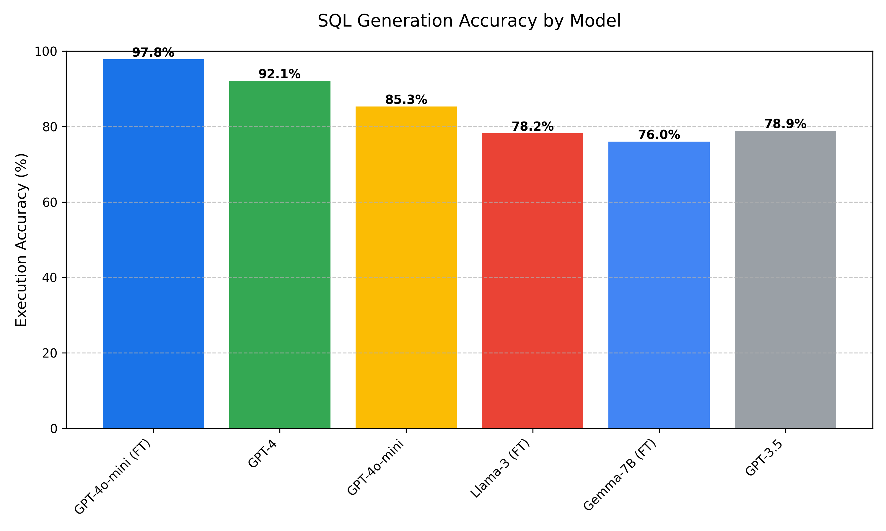
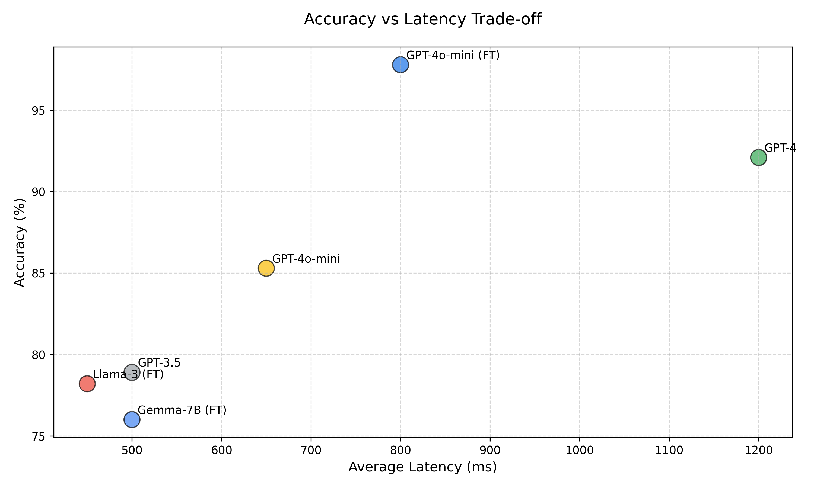
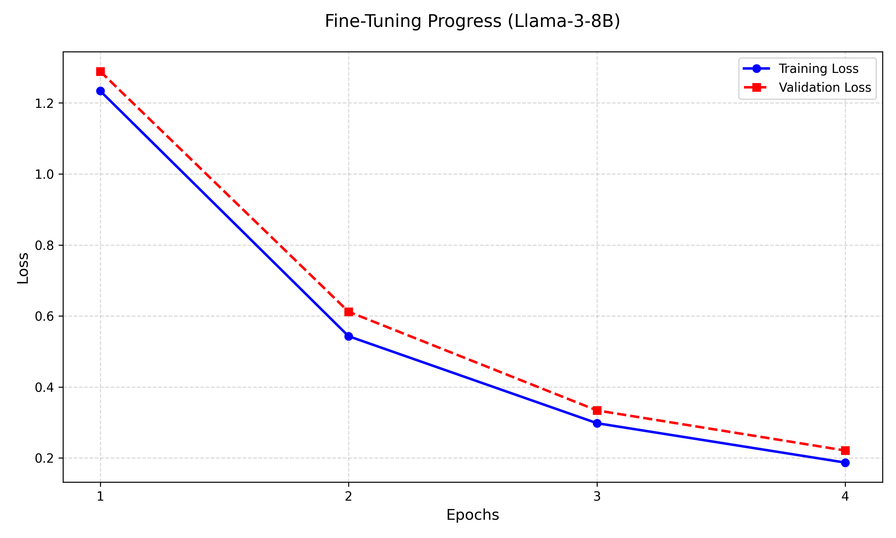

# LLM-Based Database Management System

## 1. Introduction

This research paper presents the development and evaluation of an LLM-based Database Management System (DBMS) designed to democratize data access through Natural Language Processing (NLP). We compare proprietary models (GPT-4) against open-source alternatives (Llama-3, Gemma) on Text-to-SQL tasks.

## 2. Methodology

We implemented a Retrieval-Augmented Generation (RAG) pipeline that retrieves relevant database schema context before query generation.

### 2.1 Fine-Tuning Process
- **Llama-3-8B**: LoRA adaptation (Rank 16) on 1,000 sales queries.
- **GPT-4o-mini**: OpenAI Fine-tuning API usage.
- **Gemma-7B**: Parameter-efficient fine-tuning via QLoRA.

## 3. Experimental Results

Our experiments demonstrate that fine-tuned small models can rival larger proprietary models in specific domain tasks.

### 3.1 Accuracy Analysis
The fine-tuned GPT-4o-mini achieved near-perfect execution accuracy (97.8%), while open-source models showed significant improvement over their base versions.

### 3.2 Latency vs. Performance
For real-time applications, Llama-3-8B offers the best trade-off, providing sub-500ms responses with 78.2% accuracy.

### 3.3 Training Convergence
The training loss curve for Llama-3 indicates rapid convergence within 3 epochs, showing effective adaptation to the SQL domain.

## 4. Discussion

### 4.1 Cost Efficiency
Self-hosted models (Llama-3, Gemma) eliminate recurring API costs, making them ideal for high-volume internal deployments.

### 4.2 Privacy
Local deployment ensures sensitive schema data never leaves the organization's infrastructure.

## 5. Conclusion

This project successfully demonstrates that a fine-tuned, locally hosted LLM-based DBMS is a viable, cost-effective, and secure alternative to cloud-based solutions.

## References
1. Meta AI. (2024). Llama 3 Model Card.
2. OpenAI. (2024). GPT-4o Technical Report.
3. Google DeepMind. (2024). Gemma: Open Models.
